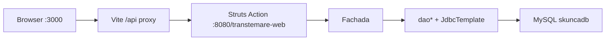

# Arquitectura Transtemare

## Módulos

```
tramstemare/
├── transtemare-core/     # Dominio + persistencia (JAR)
├── transtemare-web/      # Struts UI/API + reportes (WAR)
└── transtemare-react/    # SPA de migración (Vite)
```

No hay POM padre: compilar **core → web** con **JDK 8**. React es independiente (npm).
Runtime WAR: **Tomcat 8.5** (`/transtemare-web`).

## Flujo de request



## Capas Java

| Capa | Paquete | Responsabilidad |
|------|---------|-----------------|
| Action | `com.web.transtemare.acciones.*` | HTTP, params, JSON/stream |
| Fachada | `com.core.transtemare.commons` | Orquestación / transacciones |
| DAO | `com.core.transtemare.daos` | JDBC |
| SQL | `com.core.transtemare.persistencia.sql` | Constantes SQL |
| Entity | `com.core.transtemare.entidades` | POJOs (sin JPA) |
| DTO | `com.core.transtemare.dto` | Respuestas grid/JSON |

Wiring: `struts.objectFactory = spring` + beans en `WEB-INF/applicationContext.xml`.

## Auth

- Sesión HTTP (`JSESSIONID`), timeout 30 min.
- `AuthenticationInterceptor` exige `session.loged`.
- Login en paquete Struts `login` (sin interceptor).
- React: cookies vía proxy; probe con `jsonEmpresas`.

## Persistencia

- Spring JDBC + c3p0 (Hibernate comentado / no usado).
- Scripts manuales en `transtemare-core/sqlscripts/`.

## Reportes

JasperReports: action carga `Carpeta` → `cargarParametros()` → fill/export PDF stream.  
Plantillas: `transtemare-web/src/main/resources/documentos/*.jrxml`.

## Frontend

SPA con rutas anidadas bajo `Layout` + `RequireAuth`.  
Dominios migrados: empresas, transportadoras, camiones, terminales, carpetas (parcial).  
Estilo: MUI theme en `src/theme.ts`.

## Referencias clave

- Spring: `transtemare-web/src/main/webapp/WEB-INF/applicationContext.xml`
- Struts: `transtemare-web/src/main/resources/struts.xml`
- Proxy: `transtemare-react/vite.config.ts`
- Fachada: `transtemare-core/.../commons/Fachada.java`
