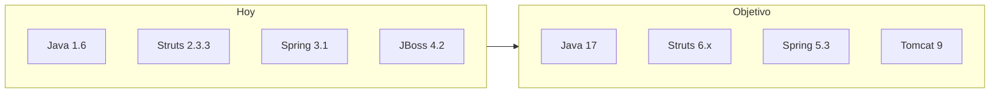

# Plan: migrar a Java 17

## Enfoque elegido

**JDK 17 + Tomcat 9 + `javax.*` + Struts 6.x + Spring 5.3.x.**

No ir a Jakarta/Tomcat 10 en este paso: el código usa `javax.servlet` (7 archivos), React ya consume acciones Struts, y Jakarta implicaría Struts 7 + Spring 6 + reescritura de servlet/JSP. JBoss 4.2.3 (Cargo actual) queda fuera: no soporta Java 17.

## Por qué no alcanza con cambiar el `source/target`

Los POMs apuntan a 1.6 ([transtemare-core/pom.xml](transtemare-core/pom.xml), [transtemare-web/pom.xml](transtemare-web/pom.xml)). Con solo `release=17` el stack actual **no arranca**:

| Bloqueador | Actual | Destino |
|------------|--------|---------|
| Struts | 2.3.3 | 6.7.x |
| Spring | 3.1.x | 5.3.31 |
| MySQL | connector 5.1.21 | `mysql-connector-j` 8.0.x |
| JasperReports | 5.5.2 | 6.21.x |
| XStream | 1.3.1 | 1.4.20+ |
| Runtime | JBoss 4.2 / Tomcat 6 | Tomcat 9.0.x |
| `web.xml` | Servlet 2.5 + `FilterDispatcher` | 4.0 + `StrutsPrepareAndExecuteFilter` |

El código de aplicación (~142 `.java`) casi no necesita cambios de lenguaje; el trabajo es **dependencias + config + regresión**.

---

## Fase 0 — Base de build

1. Crear POM padre en la raíz (`groupId` `com.transtemare`) que unifique `transtemare-core` y `transtemare-web`.
2. Propiedades centrales: `java.version=17`, versiones de Struts/Spring/Jasper/MySQL.
3. `maven-compiler-plugin` 3.11+ con `<release>17</release>` en ambos módulos.
4. Documentar en [`.cursor/docs/local-dev.md`](.cursor/docs/local-dev.md): JDK 17 + Tomcat 9 (reemplazar JBoss).
5. Actualizar regla [`.cursor/rules/java-backend.mdc`](.cursor/rules/java-backend.mdc) (dejar de exigir estilo Java 1.6).

---

## Fase 1 — Dependencias core (bajo riesgo)

En [transtemare-core/pom.xml](transtemare-core/pom.xml):

- `spring-jdbc` → **5.3.31**
- `c3p0` → `com.mchange:c3p0:0.9.5.5` (o HikariCP si se prefiere al tocar datasource)
- Quitar `cglib-nodep` (Spring 5 trae su propio proxy)
- `commons-lang3` → 3.14.x
- Logging: planificar salida de log4j 1.2.17 → Log4j2 o SLF4J+Logback (puede ir en Fase 1b si bloquea)

Compilar solo core: `mvn -pl transtemare-core clean install`.

---

## Fase 2 — Struts + Spring + web.xml (riesgo alto)

En [transtemare-web/pom.xml](transtemare-web/pom.xml):

- `struts2.version` → **6.7.x** (plugins: core, spring, convention, json; **eliminar** `struts2-dojo-plugin`)
- Evaluar `struts2-jquery-*` 3.3.0 y `jmesa` 3.0.4: upgrade compatible o excluir si solo sirven a JSP ya reemplazados por React
- `spring-web` → **5.3.31**
- `javax.servlet-api` **4.0.1** + `javax.servlet.jsp-api` **2.3.3** (`provided`)
- Cargo: `tomcat9x` (o documentar deploy manual y deprecar Cargo JBoss)

En [web.xml](transtemare-web/src/main/webapp/WEB-INF/web.xml):

- `version="4.0"`
- Reemplazar las 4 entradas de `FilterDispatcher` por **un** filtro `org.apache.struts2.dispatcher.filter.StrutsPrepareAndExecuteFilter` mapeado a `/*` (o el patrón que use Struts 6)

En [applicationContext.xml](transtemare-web/src/main/webapp/WEB-INF/applicationContext.xml):

- XSDs Spring 5 (`spring-beans.xsd`, `spring-tx.xsd`, …)
- Reemplazar `<ref local=` por `ref=`
- Sustituir beans `org.springframework.scheduling.timer.*` (líneas ~326–354) por `TaskScheduler` / `@Scheduled` o Quartz 2.3 (el timer API se eliminó en Spring 4+)
- Driver MySQL: `com.mysql.cj.jdbc.Driver` + URL con `serverTimezone=...`

Revisar [struts.xml](transtemare-web/src/main/resources/struts.xml) y properties Struts 2.3→6 (OGNL, `struts.enable.DynamicMethodInvocation`, etc.).

---

## Fase 3 — MySQL, Jasper, XStream (riesgo alto funcional)

1. **MySQL**: `com.mysql:mysql-connector-j:8.0.33+`; actualizar driver en `applicationContext.xml` y [Configuraciones.java](transtemare-core/src/main/java/com/core/transtemare/entidades/Configuraciones.java) si aplica.
2. **JasperReports 6.21.x**: recompilar/probar los 5 `.jrxml` en `resources/documentos/` y actions `CRT`, `MICDTA`, `SABANA`, `Caratula` (+ histórico).
3. **XStream 1.4.20+** con allowlist de tipos en:
   - [JSONHistoricoCarpetas.java](transtemare-web/src/main/java/com/web/transtemare/acciones/historico/JSONHistoricoCarpetas.java)
   - `CRTHistoricoV1`, `MICDTAHistoricoV1`, `CaratulaHistoricoV1`
4. Logging: migrar `log4j.xml` 1.x a Log4j2/Logback para evitar problemas en Java 17.

---

## Fase 4 — Compilar, corregir y endurecer

1. `mvn clean install` en el reactor padre.
2. Corregir roturas de API Struts/Spring (imports, resultados JSON, interceptors).
3. Limpieza opcional no bloqueante: `new Integer`/`new Long` en DAOs, raw `Map` en login/interceptor.
4. Si aparecen `IllegalAccessError` de módulos: preferir upgrade de lib; solo como puente temporal `--add-opens` en Tomcat `setenv`.

---

## Fase 5 — Runtime y regresión

1. Desplegar WAR en **Tomcat 9** (`/transtemare-web`).
2. Smoke backend: login, grids JSON, ABM camiones/empresas, alta/edición carpeta.
3. Smoke reportes: CRT, MICDTA (± camión sust.), carátula, histórico.
4. Smoke React (`npm run dev`): proxy `/api`, cookie de sesión, mismas pantallas.
5. Actualizar docs: [architecture.md](.cursor/docs/architecture.md), [local-dev.md](.cursor/docs/local-dev.md), [presentacion-sistema.html](.cursor/docs/presentacion-sistema.html) (stack).

---

## Fuera de alcance (esta migración)

- Jakarta / Tomcat 10 / Spring 6 / Struts 7
- Reescritura a `java.time`
- Reemplazo total de JSP restantes
- Cambios en el contrato React ↔ Struts (salvo ajustes de filtro/sesión)

## Criterio de éxito

- Build con JDK 17 sin errores
- WAR desplegado en Tomcat 9
- Login + CRUD maestros + carpetas + PDFs OK
- SPA React contra el mismo backend OK
