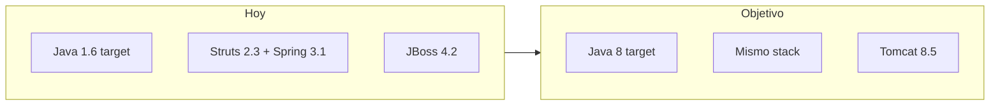

# Plan: migrar a Java 8

## Enfoque

**Solo bytecode/runtime Java 8.** El stack actual (Struts 2.3.3, Spring 3.1, Servlet 2.5, JasperReports 5.5.2) es compatible con JDK 8; no hace falta el salto a Struts 6 / Spring 5 del plan a Java 17.

El entorno ya tiene **JDK 8** (`1.8.0_401` / Temurin 8). El bloqueo real de runtime es **JBoss 4.2.3** (Cargo en [transtemare-web/pom.xml](transtemare-web/pom.xml)): no corre sobre Java 8. Destino de despliegue: **Tomcat 8.5** en `:8080` con contexto `/transtemare-web` (sin cambiar el proxy de React).



## Fuera de alcance

- Struts 6 / Spring 5 / Jasper 6 / XStream allowlist / Log4j2
- Jakarta / Tomcat 10
- Reescritura de código a lambdas/`java.time` (permitido usar Java 8, no obligatorio)

---

## Fase 1 — Compilar con Java 8

En ambos módulos, subir el compiler a 1.8 y fijar versión del plugin:

- [transtemare-core/pom.xml](transtemare-core/pom.xml): `source`/`target` `1.8`, `maven-compiler-plugin` 3.11.0
- [transtemare-web/pom.xml](transtemare-web/pom.xml): igual

Sin POM padre (mantener dos módulos independientes como hoy).

Verificar:

```bash
cd transtemare-core && mvn clean install
cd ../transtemare-web && mvn clean package
```

Corregir solo errores de compilación si aparecen (poco probable: el código es 1.6-compatible).

---

## Fase 2 — Runtime Tomcat 8.5

1. En [transtemare-web/pom.xml](transtemare-web/pom.xml), actualizar Cargo de `jboss42x` a `tomcat85x` (o documentar deploy manual y dejar Cargo comentado/deprecado si no se usa).
2. Desplegar `transtemare-web/target/transtemare-web.war` en Tomcat 8.5.
3. No tocar [web.xml](transtemare-web/src/main/webapp/WEB-INF/web.xml) (`FilterDispatcher` y Servlet 2.5 siguen válidos).
4. No tocar [applicationContext.xml](transtemare-web/src/main/webapp/WEB-INF/applicationContext.xml) (driver MySQL 5.x y timer Spring 3.1 siguen OK en Java 8).

---

## Fase 3 — Docs y reglas

Actualizar para reflejar Java 8 + Tomcat 8.5:

- [`.cursor/docs/local-dev.md`](.cursor/docs/local-dev.md)
- [`.cursor/docs/architecture.md`](.cursor/docs/architecture.md)
- [`.cursor/rules/java-backend.mdc`](.cursor/rules/java-backend.mdc) (dejar de exigir “solo estilo 1.6”; indicar target 8)
- Ajuste breve de stack en [`.cursor/docs/presentacion-sistema.html`](.cursor/docs/presentacion-sistema.html) si menciona Java 1.6

---

## Fase 4 — Regresión smoke

Con Tomcat 8.5 + JDK 8:

1. Login Struts / sesión
2. Grids JSON + ABM (empresas/camiones)
3. Carpetas + PDF CRT/MICDTA
4. React `npm run dev` contra `/api` (proxy sin cambios)

## Criterio de éxito

- `mvn` produce WAR con bytecode Java 8
- App corre en Tomcat 8.5 con JDK 8
- React y reportes siguen funcionando como hoy
