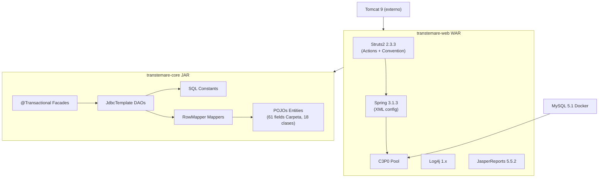
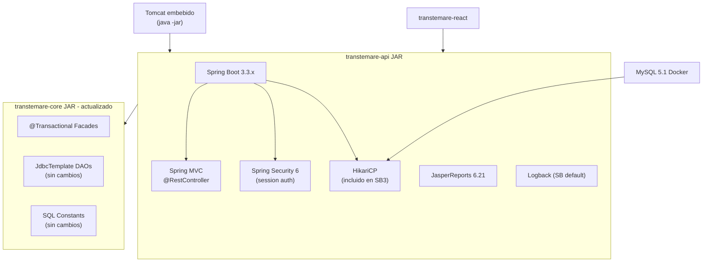

# Plan de Actualización Backend: transtemare-api (Spring Boot 3)

## Estado actual del stack



## Stack objetivo



## Fases de implementación

### Fase 1: Preparación del entorno y estructura del módulo

**Objetivo:** Crear el andamiaje del nuevo módulo sin romper nada existente.

- Actualizar el `pom.xml` raíz para incluir `transtemare-api` en `<modules>` y fijar `<java.version>17</java.version>`
- Crear `transtemare-api/pom.xml` con:
  - `parent`: `spring-boot-starter-parent 3.3.x`
  - `dependency`: `transtemare-core 0.0.1-SNAPSHOT`
  - `dependency`: `spring-boot-starter-web`, `spring-boot-starter-jdbc`, `spring-boot-starter-security`
  - `dependency`: `mysql:mysql-connector-j 8.x` (reemplaza el driver 5.1.21 — el driver 8.x es retrocompatible con MySQL 5.1)
  - `packaging`: `jar`
- Crear `TranstamareApiApplication.java` con `@SpringBootApplication`
- Crear `src/main/resources/application.properties`:
  - `spring.datasource.url=jdbc:mysql://localhost:3306/skuncadb?allowPublicKeyRetrieval=true&useSSL=false`
  - `spring.datasource.username/password=root/root`
  - Pool HikariCP con los mismos parámetros que el C3P0 actual
  - `server.port=8081` (para correr paralelo al legacy WAR en 8080 durante transición)

- **Compatibilidad de `transtemare-core`:** el código Java 6/8 del core compila con Java 17 sin cambios. Solo hay que actualizar la versión de Spring JDBC en `transtemare-core/pom.xml` a `6.1.x` (compatible con Spring Boot 3.3) y verificar que `org.springframework.transaction.annotation.@Transactional` no cambió (no cambió — es Spring propio, no `javax.transaction`).

### Fase 2: Configuración Spring Boot (reemplaza applicationContext.xml)

**Objetivo:** Reemplazar el XML de Spring por `@Configuration`.

Crear `config/DataSourceConfig.java`:
```java
@Configuration
public class DataSourceConfig {
    @Bean public DataSource dataSource(DataSourceProperties props) { ... }
    @Bean public DataSourceTransactionManager transactionManager(DataSource ds) { ... }
    // Instanciar DAOs y Facades como @Bean, igual que applicationContext.xml
    @Bean public daoCarpeta daoCarpeta(DataSourceTransactionManager tm) { ... }
    @Bean public FachadaCarpetas fachadaCarpetas(...) { ... }
    @Bean public Fachada fachada(...) { ... }
}
```

Crear `config/SecurityConfig.java` con Spring Security 6 para replicar el interceptor de autenticación de Struts2 (sesión HTTP).

### Fase 3: Controladores REST (reemplaza Struts2 Actions)

**Objetivo:** Un `@RestController` por dominio, usando exactamente los mismos URLs que consume `transtemare-react` para que el frontend no necesite cambios.

Mapeo directo de acciones existentes a controladores nuevos:

- `CarpetasController.java` (`/jsonCarpetas`, `/NuevaCarpeta`, `/pasarCarpetaHistorico`)
  - Fuente: [`JSONCarpetas.java`](transtemare-web/src/main/java/com/web/transtemare/acciones/carpetas/JSONCarpetas.java), [`JSONHistoricoCarpetas.java`](transtemare-web/src/main/java/com/web/transtemare/acciones/historico/JSONHistoricoCarpetas.java)
- `TransportadorasController.java` (`/jsonTableTransportadoras`, `/jsonListaTransportadoras`, ABM)
- `CamionesController.java` (`/jsonTableCamiones`, `/jsonListaCamiones`)
- `ListasController.java` (todos los `/jsonLista*`: países, monedas, terminales, camiones, etc.)
- `ReportesController.java` (`/CRT`, `/MICDTA`, `/SABANA`, `/CARATULA`)
  - Retornan `ResponseEntity<byte[]>` con `Content-Type: application/pdf`

Mejoras al API en cada controlador:
- Respuestas JSON estandarizadas con un `ApiResponse<T>` wrapper
- `@ControllerAdvice` para manejo global de errores (reemplaza `simpleecho.jsp`)
- Códigos HTTP correctos (200, 201, 400, 404, 500) en vez de siempre 200

El endpoint `/NuevaCarpeta` — actualmente un redirect Struts que el React parsea — puede ahora retornar JSON directo `{ "idCarpeta": 123 }` y actualizar el cliente React.

### Fase 4: Migración de reportes JasperReports

**Objetivo:** Los endpoints PDF funcionan en Spring Boot sin Struts.

- Actualizar `net.sf.jasperreports:jasperreports` de `5.5.2` a `6.21.x` en `transtemare-api/pom.xml`
- La lógica de compilación y fill del reporte en [`CRT.java`](transtemare-web/src/main/java/com/web/transtemare/acciones/reportes/CRT.java) y [`MICDTA.java`](transtemare-web/src/main/java/com/web/transtemare/acciones/reportes/MICDTA.java) se traslada a `@Service` classes
- `LogoHelper.java` se mueve a `transtemare-core` para que sea reutilizable desde `transtemare-api`
- Los controllers retornan el PDF como stream con header `Content-Disposition: attachment`

### Fase 5: Mejoras de acceso a datos

**Objetivo:** Modernizar la capa de datos preservando la lógica SQL existente.

Mejoras a bajo riesgo (mantener JdbcTemplate):
- Reemplazar C3P0 por HikariCP (ya incluido en Spring Boot, configuración por properties)
- Actualizar MySQL connector de `5.1.21` a `8.x`
- Eliminar la inicialización manual de `JdbcTemplate` en cada DAO vía `setTransactionManager` — en su lugar inyectar `JdbcTemplate` directamente como `@Autowired` (Spring Boot autoconfigura uno solo)
- Unificar los dos beans `daoCarpetas` / `daoCarpeta` (actualmente duplicados en `applicationContext.xml`)

Mejora opcional (paso siguiente): Spring Data JDBC
- Mantiene control total sobre SQL (sin ORM mágico)
- Los `RowMapper` existentes son compatibles con `RowMapper<T>` de Spring Data JDBC
- Permite agregar `@Repository` estándar con queries tipadas

### Fase 6: Autenticación y seguridad

**Objetivo:** Reemplazar el interceptor de Struts2 con Spring Security 6.

- `SecurityConfig` con sesión HTTP (compatible con el flujo actual del React sin cambios)
- Endpoint `POST /entrar` → `AuthenticationManager` de Spring Security
- `GET /salir` → invalidar sesión
- `@PreAuthorize` en controllers para control de acceso por perfil
- CORS configurado para `http://localhost:5173` (React dev server)

### Fase 7: Observabilidad y documentación de API

**Objetivo:** Tener visibilidad del sistema y documentación del API para facilitar el mantenimiento.

- Agregar `spring-boot-starter-actuator` — endpoints `/actuator/health`, `/actuator/metrics`
- Agregar `springdoc-openapi-starter-webmvc-ui 2.x` — genera Swagger UI automáticamente en `/swagger-ui.html`
- Migrar de `log4j 1.x` a Logback (ya es el default de Spring Boot — solo eliminar dependencia de `log4j` y `slf4j-log4j12`)

## Archivos clave a crear / modificar

- `pom.xml` (raíz): agregar módulo `transtemare-api`, actualizar `java.version` a 17
- `transtemare-core/pom.xml`: actualizar `spring-jdbc` de `3.1.2.RELEASE` a `6.1.x`
- `transtemare-api/pom.xml` (NUEVO)
- `transtemare-api/src/main/java/com/transtemare/api/TranstamareApiApplication.java` (NUEVO)
- `transtemare-api/src/main/java/com/transtemare/api/config/DataSourceConfig.java` (NUEVO)
- `transtemare-api/src/main/java/com/transtemare/api/config/SecurityConfig.java` (NUEVO)
- `transtemare-api/src/main/java/com/transtemare/api/controllers/*.java` (NUEVOS, ~6-8 clases)
- `transtemare-api/src/main/resources/application.properties` (NUEVO)
- `transtemare-web/src/main/java/com/web/transtemare/acciones/transportadora/LogoHelper.java` → mover a `transtemare-core`

## Estrategia de transición

- Durante la migración, `transtemare-web` (Tomcat 8080) y `transtemare-api` (Spring Boot 8081) pueden correr simultáneamente
- El frontend React actualiza el proxy de Vite de `8080` a `8081` cuando un endpoint específico está listo en el nuevo API
- Una vez todos los endpoints migrados y probados, se descomisiona el WAR y Tomcat
