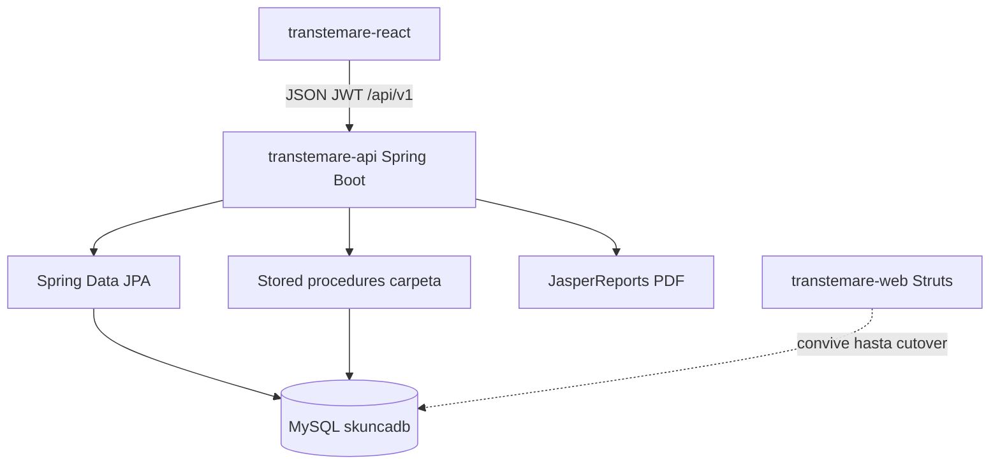

# Plan: Transtemare API Spring Boot + React REST

## Decisiones fijadas

| Tema | Elección |
|------|----------|
| Runtime | **Java 17 LTS** + **Spring Boot 3.4.x** (Jakarta EE) |
| Persistencia | **Spring Data JPA** sobre tablas existentes + llamadas a SPs críticos al inicio |
| API | REST JSON `/api/v1`, **springdoc-openapi**, paginación Spring Data |
| Seguridad | **Spring Security** + **JWT** (Bearer); passwords con BCrypt (migración desde plaintext) |
| Reportes | JasperReports 6.x/7.x desde servicios (mismos `.jrxml` adaptados) |
| Estrategia | **Strangler**: nuevo módulo `transtemare-api`; Struts (`transtemare-web`) convive hasta cutover; React deja de hablar con Struts |
| Frontend | Mismo React (MUI + TanStack Query); reescribir `src/api/*` a JSON REST |

Requiere instalar **JDK 17+** (hoy el entorno tiene JDK 8).



---

## Arquitectura del nuevo backend

Nuevo módulo Maven (reactor padre):

```
tramstemare/
├── pom.xml                          # parent BOM
├── transtemare-api/                 # Spring Boot app (NUEVO)
│   └── src/main/java/.../
│       ├── TranstemareApplication
│       ├── config/                  # Security, OpenAPI, Jackson, CORS
│       ├── domain/                  # @Entity mapeando tablas legacy
│       ├── repository/              # JpaRepository + @Query / @Procedure
│       ├── service/                 # lógica (port de Fachada*)
│       ├── web/                     # @RestController + DTOs
│       ├── security/                # JWT filter, UserDetails
│       └── report/                  # CRT, MICDTA, SABANA, Carátula
├── transtemare-core/                # legacy (solo lectura / referencia)
├── transtemare-web/                 # Struts (apagar al final)
└── transtemare-react/               # adaptar a /api/v1
```

**Capas (estándar):** Controller → Service → Repository. Sin Fachada monolítica; servicios por dominio (`EmpresaService`, `CarpetaService`, …).

**Contrato HTTP común:**
- JSON UTF-8
- Errores: Problem Details (`application/problem+json`) o `{ "code", "message", "details" }`
- Listas: `Page<T>` → `{ content, page, size, totalElements, totalPages }`
- Fechas: ISO-8601 (`OffsetDateTime` / `LocalDate`)
- Soft-delete: seguir `Activo=0` como hoy

---

## Base de datos (sin romper producción)

1. **Exportar baseline** de `skuncadb` (no hay `CREATE TABLE` en el repo) → script Flyway `V1__baseline.sql` con `flyway baseline` / `baseline-on-migrate`.
2. Mapear entidades JPA con nombres reales (`@Table(name="carpeta")`, columnas mixtas, typo `CodLocallidad_FK`).
3. **Conservar SPs al inicio** (lógica crítica):
   - `sp_numeradores` — alta carpeta/MIC
   - `sp_buscar_carpeta` — carga completa
   - `sp_pasar_historico` — archivo
4. Más adelante (fase opcional): reescribir SPs a servicios transaccionales Java; no bloquear el MVP.

Tablas activas a modelar: `carpeta`, `empresas`, `transportadora`, `numeradores`, `camion`, `responsable`, `localidad`, `pais`, `rutas`, `bultos`, `terminales`, `historicos`, `user`, `marca_camiones`.

---

## API REST objetivo (`/api/v1`)

### Auth
- `POST /auth/login` `{ username, password }` → `{ accessToken, expiresIn, user }`
- `GET /auth/me`
- `POST /auth/logout` (stateless JWT: client discard; blacklist opcional)

### CRUD (reemplaza jqGrid + ABM)
`GET/POST /empresas`, `GET/PUT/DELETE /empresas/{id}` — igual para `transportadoras`, `camiones`, `terminales`, `choferes`, `localidades`.

Query: `?page=0&size=15&sort=nombre,asc&q=` o filtros tipados.

### Carpetas (núcleo)
- `GET /carpetas` — lista CRT activas
- `POST /carpetas` — alta (`transportadoraId`, `cantidadMic`) ← `NuevaCarpeta`
- `GET /carpetas/{id}` — **nuevo** (hoy React no carga el form)
- `PUT /carpetas/{id}` — guardar ← `CrearCarpeta` (JSON, no HTML)
- `GET /carpetas/{id}/subcarpetas`
- `POST /carpetas/{id}/historico`
- `GET /carpetas/{id}/documentos/{crt|micdta|sabana|caratula}?camionSustituto=`

### Lookups
`GET /lookups/{recurso}?q=` → `[{ id, label }]` (eliminar encoding `id--label`).

### Extras (fase 2 UI)
Histórico, alarmas, logos transportadora, reportes garantía, usuarios.

OpenAPI en `/swagger-ui.html` para contrato vivo entre backend y React.

---

## Port de lógica de negocio

Prioridad al portar desde [Fachada](transtemare-core/src/main/java/com/core/transtemare/commons/Fachada.java) / DAOs:

1. Auth + maestros (empresas, transportadoras, camiones, terminales, localidades, choferes)
2. Lookups usados por CarpetasForm
3. Carpetas: create (SP) → get (SP) → update (UPDATE masivo) → list → histórico
4. PDFs Jasper (reusar plantillas en `resources/documentos/`)
5. Alarmas / garantía / usuarios

Reglas a preservar: soft-delete, filtros `historico=0 AND esCRT=1`, tipos empresa 0–3, camión vs remolque por `tipo`, numeradores por transportadora.

Mejoras de estándar (sin cambiar semántica de negocio):
- Passwords hasheados (script one-shot de migración de `user`)
- Validación Bean Validation (`@Valid`, `@NotNull`, …)
- Transacciones `@Transactional` en servicios
- Tests: unitarios de servicios + `@SpringBootTest` + Testcontainers MySQL para carpetas/SPs

---

## Adaptación React

Archivos clave: [client.ts](transtemare-react/src/api/client.ts), [auth.ts](transtemare-react/src/api/auth.ts), módulos `api/*`, [vite.config.ts](transtemare-react/vite.config.ts), páginas CRUD y Carpetas.

1. **Proxy Vite:** `/api` → `http://localhost:8080` (contexto del Boot, p.ej. sin `/transtemare-web` o con `server.servlet.context-path=` vacío y API en `/api/v1`).
2. **Axios:** `Content-Type: application/json`; interceptor `Authorization: Bearer <token>`; quitar dependencia de cookies Struts.
3. **AuthContext:** login/me/logout contra nuevos endpoints; guardar token (memory + `sessionStorage` o cookie httpOnly si se elige cookie-based más adelante).
4. **Grids:** mapear `Page` Spring → DataGrid (`content` → rows, `totalElements` → `rowCount`, page **0-based**).
5. **CRUD:** `POST/PUT/DELETE` JSON; eliminar `oper`/`id=_empty`.
6. **Lookups:** reemplazar `LegacyAutocompleteField` por componente que consuma `{ id, label }`.
7. **Carpetas:** `crearNuevaCarpeta` → `POST` JSON; `guardarCarpeta` → `PUT` JSON; **añadir carga** `GET /carpetas/{id}` en `CarpetasFormPage`; PDFs → `window.open` con token (query `?access_token=` corto o blob fetch con Authorization).
8. Tipos TS alineados a DTOs OpenAPI (generación opcional con `openapi-typescript` en fase posterior).

---

## Fases de entrega

### Fase 0 — Fundación (1 sprint)
- Parent POM + `transtemare-api` Spring Boot 3.4
- Flyway baseline desde dump
- Security JWT + `/auth/*`
- CORS, OpenAPI, `application.yml` (datasource, JWT secret)
- Docs en `.cursor/docs` (arquitectura nueva)

### Fase 1 — Maestros + React CRUD
- API empresas, transportadoras, camiones, terminales (+ logos)
- Migrar páginas React correspondientes
- Smoke E2E manual

### Fase 2 — Lookups + Carpetas API
- Todos los `/lookups/*`
- Carpetas CRUD + SP integration + GET by id
- Histórico endpoint
- Adaptar `CarpetasPage` / `CarpetasFormPage` / autocompletes

### Fase 3 — Reportes + dominios JSP restantes
- PDF CRT/MICDTA/SABANA/Carátula
- Choferes, localidades UI React
- Alarmas, histórico UI
- Cutover: apagar proxy a Struts; archivar `transtemare-web`

### Fase 4 — Endurecimiento
- Hash passwords, rate limit login
- Tests Testcontainers en CI
- Observabilidad (Actuator + logging estructurado)
- Evaluar inlining de SPs

---

## Criterios de éxito

- Misma DB `skuncadb` sin migración destructiva de datos
- React 100% contra `/api/v1` (cero llamadas `.action` / ABM / jqGrid)
- Paridad funcional: login, maestros, carpetas alta/edición, PDFs, histórico
- OpenAPI publicado; build `mvn verify` + `npm run build` en verde

## Fuera de alcance inicial

- Reescritura completa del esquema SQL (normalización agresiva)
- Microservicios / event-driven
- Reemplazo de MUI
- App móvil
